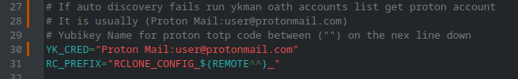

# Proton Drive Auto-Mount for Linux

Mount your Proton Drive as a local folder at `~/ProtonDrive` with **zero-persistence security** — no session tokens are ever left on disk after you unmount.

On first run, the script walks you through setup with simple popups. After that, mounting is one click (or one command) — your username and password are remembered, and you just supply the current 2FA code.

## Target environment

**KDE Plasma** (uses `kdialog`) and **GNOME / other desktops** (uses `zenity`) — the scripts auto-detect whichever is installed. A terminal-only fallback also works over SSH.

Tested on: **Ultramarine Linux 44 — KDE Plasma (Fedora 44 base)**, rclone v1.74.3. Should work on any Fedora-based setup. GNOME/zenity support is built in but not yet field-tested — testing on a GNOME VM is in progress.

## How it works

| Moment | What happens |
|---|---|
| First run | Username + password wizard → saved to `~/.config/proton-automount.env` (mode 600) |
| Every mount thereafter | Credentials loaded from env file → **2FA step only** (YubiKey touch or TOTP popup) → mount |
| Drive mounted | The rclone daemon's session lives **in RAM only** — tokens are purged from disk |
| Unmount (Dolphin or script) | Stays unmounted. No background watcher. Nothing remounts until you run the script again |
| Account has no 2FA | Leave the TOTP popup empty — logs in with password only |

Between sessions, there are no valid session tokens anywhere on disk — every mount requires a genuine, current 2FA code (when 2FA is enabled on the account).

## Requirements

- rclone **v1.64.0 or newer** (that's when the Proton Drive backend was added)
- FUSE / fuse3
- `kdialog` (ships with KDE Plasma) **or** `zenity` (GNOME and most desktops)
- Optional: `ykman` (YubiKey automatic TOTP), `notify-send` (desktop notifications)

> ⚠ Note: rclone has flagged the Proton Drive backend as **unmaintained**. Newer rclone versions can be hit-or-miss — tested working on v1.74.3.

## Install

```bash
./install.sh
```

Installs rclone, FUSE, ykman, and libnotify for your distro (dnf / apt / pacman / zypper detected automatically). It installs `zenity` if no `kdialog` is present. The installer also verifies your rclone version is ≥ 1.64, and creates **Proton Drive** menu launchers automatically (including a right-click **Uninstall** action) — no manual launcher setup needed.

Then make the scripts executable if needed:

```bash
chmod +x proton-automount.sh uninstall.sh
```

## First run

```bash
./proton-automount.sh
```

A popup asks for your Proton username:


Then your password (input is hidden):


Credentials are saved to `~/.config/proton-automount.env` with owner-only permissions (`600`) — verify after first run:


You will then be asked for your 2FA code (see YubiKey section below, or type the code manually). The drive mounts at `~/ProtonDrive` and a notification confirms it.

## YubiKey automatic 2FA (optional)

If a YubiKey is plugged in, the script reads the current TOTP code straight off the key — you just touch it, no typing.

**No setup needed for most users:** the script automatically finds a YubiKey credential whose name contains your Proton username, preferring credentials issued by Proton Mail. Plug in your key, run the script, touch the key when prompted — that's it.

**If auto-detection fails or picks the wrong credential,** list your credential names:

```bash
ykman oath accounts list
```

(Example output: `Proton Mail:you@example.com`)

Then open `proton-automount.sh` and set the credential in the `YK_CRED` variable in Line 30 of proton-automount.sh:



That line has nothing else on it, so even very long credential names are safe to paste — nothing else can break. A manual `YK_CRED` always overrides auto-detection.

If **multiple** credentials match your username and none are Proton Mail credentials, the script refuses to guess — it lists the candidates in the log (`~/.local/state/proton-mount.log`) so you can pick the right one for `YK_CRED`.

Tip: the credential should have touch **enabled** (Yubico Authenticator app → credential → settings). The script waits 30 seconds for a touch and pops a dialog telling you to touch the key.

No YubiKey? Skip this entirely — you'll get a TOTP popup instead. No 2FA on your account at all? Leave the popup empty and it logs in with password only.

## Everyday use

- **Mount:** click **Proton Drive** in your application menu (created by the installer), or run `./proton-automount.sh`. Touch your YubiKey or enter the current code. Done.
- **Unmount:** right-click `~/ProtonDrive` → Unmount in Dolphin, or run `./proton-automount.sh unmount`.
- **Remount:** just run the script again — username/password are remembered, only the 2FA step repeats.

Logs live at `~/.local/state/proton-mount.log` if anything ever misbehaves (includes rclone's own mount output).

## Security model

The script enforces a strict credential lifecycle:

1. **Environment file** — your Proton username and password are saved once to `~/.config/proton-automount.env` with `600` permissions. They are loaded on every mount but never written to rclone.conf.

2. **At login start** — any cached `[protondrive]` section in `rclone.conf` (access/refresh tokens, salted key) is deleted. This *forces* a fresh login using the env file credentials + a current 2FA code. Without it, a previous session's cache would let *any* credentials mount again.

3. **During mount** — credentials are passed to rclone via environment variables (`RCLONE_CONFIG_PROTONDRIVE_*`) and `rclone obscure` is applied at runtime.

4. **After mount** — the `[protondrive]` section in `rclone.conf` is purged again within seconds of the mount coming up. The daemon keeps its session in memory only.

5. **On unmount** (via the script) — purged again.

Net effect: backend tokens exist on disk only for the brief login window. `rclone config delete` removes *only* the `[protondrive]` section — any other remotes you keep in `rclone.conf` are untouched.

**Honest limits of this design:**

- Your Proton **password** is stored in plaintext in `~/.config/proton-automount.env`, protected by `600` file permissions. That's the trade-off for "only 2FA on every remount." Use full-disk encryption (LUKS) if you need the file protected at rest.
- `rclone obscure` is used at runtime, but it's encoding, not encryption.
- If you unmount from Dolphin rather than the script, stale tokens sit inert in `rclone.conf` until the next script run purges them.

## ⚠ Do NOT rm -rf through the mount

While `~/ProtonDrive` is mounted, it **is** your Proton Drive — not a copy. Deleting files through the mount deletes them from the cloud. A careless `rm -rf ~/ProtonDrive/*` while mounted destroys cloud data, likely permanently. Be careful with cleanup commands that match the mountpoint while it's mounted.

## Uninstall

```bash
./uninstall.sh
```

Or right-click the **Proton Drive** menu entry and choose **Uninstall Proton Drive**. If the drive is mounted, the uninstaller refuses and tells you to unmount first:


After confirming, it removes saved credentials, rclone backend tokens, VFS caches, the mountpoint, and the log — everything:


It only removes the `[protondrive]` section from `rclone.conf`, so other remotes are safe.

## Project files

| File | Purpose |
|---|---|
| `proton-automount.sh` | Mount script (run this) |
| `install.sh` | Dependency installer + launcher creation (dnf/apt/pacman/zypper) |
| `uninstall.sh` | Full cleanup / removal |

## Known limitations

- GNOME/zenity support is built in but not yet field-tested — verify against a GNOME install before relying on it
- Each mount performs a full login (SRP + 2FA), which takes a few seconds longer than cached-credential mounts — that's intentional
- Repeated failed logins can hit Proton's rate limiting; wait a few minutes if you mistype your password/2FA several times
- Accounts using hardware-security-key-only 2FA (FIDO2) are not supported — TOTP-based 2FA is required

## Changelog

### v1.2.0

- **Cross-desktop dialogs:** kdialog → zenity → terminal fallback, auto-detected at runtime
- **YubiKey credential auto-detection** — no placeholder editing; manual override via `YK_CRED` if needed
- **Installer now creates menu launchers** automatically, including a right-click uninstall action
- **Fixed:** instructional comments severing a line continuation had silently disabled the 30-second YubiKey touch timeout since the first release
- **Fixed:** cancelled/lingering dialogs staying on screen (backgrounded function created a subshell that survived the kill)
- **Fixed:** passwords beginning with `-` breaking `rclone obscure` (argument terminator `--` added)
- Uninstaller detects and terminates a lingering rclone daemon

### Known issue: passwords starting with `-` (fixed in v1.2.0)

If your Proton password begins with a dash, earlier versions of the script failed at login with an error like `unknown shorthand flag: 'J' in -JSj9...` — rclone was trying to parse the password itself as a command-line flag.

**Fixed:** the script now calls `rclone obscure -- "$PROTON_PASSWORD"`. The `--` is an argument terminator that tells the program "no more flags, everything after this is data." If you're running an older copy, update to the latest version.

## License

MIT — see [LICENSE](LICENSE)
